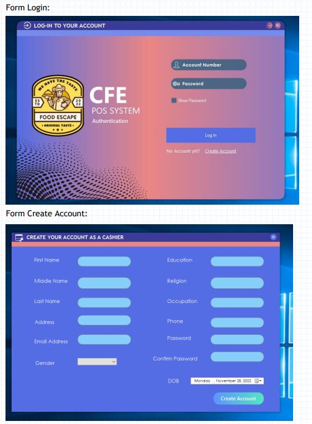
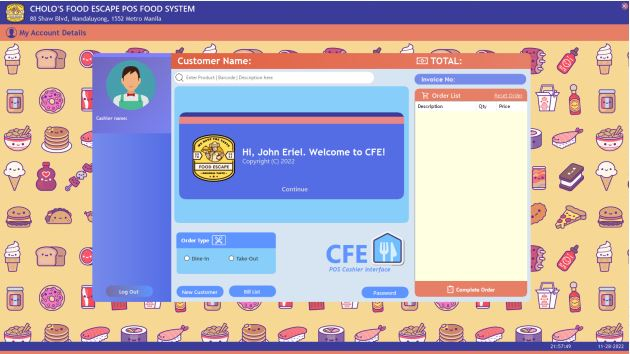
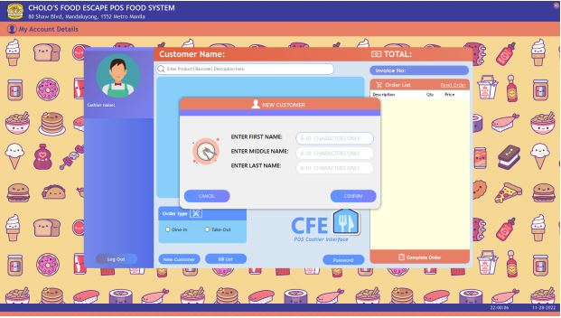
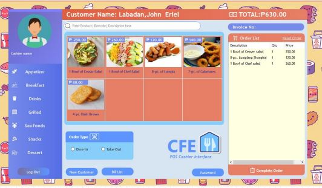
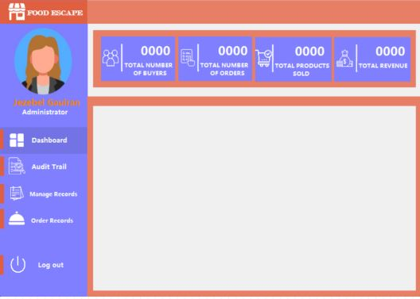

# Food POS System 🚀️

The system provides food products within the restaurant, and it is only designed for business holders, especially the cashier, which the system is suited for them the user and business managers who can handle records of their business without losing data. It consists of several functions, such as having a login module, report generation, transaction module, audit trail, etc. The system was designed in Visual Studio 2019 as its front end, and its back end comes from Microsoft Access 2019.

# How the System Works? 🚀️

In the system, we first prompt the user to enter credentials. Mainly, our users will be the cashiers. So first, they must create an account to use the system. After creating an account, they may now log in to the system. Then, after logging in, the user may now use our system. So first, when the user chooses the "New Customer" button, this button will prompt the user to input the customer's information. Then, after confirming the customer’s credentials, our system will now produce different categories of food menus.

After which, the user may now enter the customer's order by tapping the picture of the chosen product. Additionally, following the tapping of the said product, our system will prompt the user to input the quantity of the chosen product. Following that, whatever products were chosen will be compiled in a List View box by our system. Also, we added a reset and complete order button. The "Reset Order" button is created in case the customer wants to cancel their orders. The "Complete Order" button is generated to compute the total amount, VAT, payment method, discount, etc.

# Sample Screenshots? 🚀️

### Authentication Page

### Cashier Dashboard

### Adding Customer

### Dashboard w/ Food

### Checkout Page

### Administrator Page

